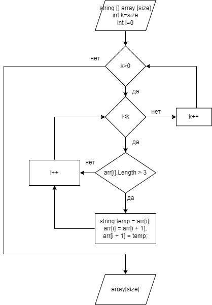
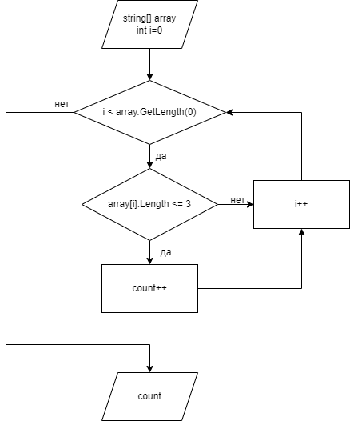
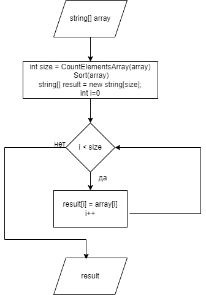

# Задание:

*Написать программу, которая из имеющегося массива строк, формирует массив из строк,длина которых меньше,или равна 3 символа.*

*Первоначальный массив можно ввести с клавиатуры,либо задать на старте выполнения алгоритма.*

# Ход решения:

1. Создаем функцию GetArray для чтения массива с клавиатуры
2. Создаем подсказки для пользователя через Console.WriteLine
3. Создаем функцию PrintArray для того,чтоб увидеть наш массив
4. Основную задачу решаем в функции NewArray,тк в описании задачи написано "формирует", а не "выводит" => есть необходимость хранить новый массив,а не выводить его сразу

5. Для корректной работы NewArray пишем еще две функции

* Аналог сортировки "пузырек" Sort
(функция переносит не подходящие нашему условию элменты в конец массива)
```
string[] Sort(string[] arr)
{
    for (int k = arr.GetLength(0) - 1; k > 0; k--)
    {
        for (int i = 0; i < k; i++)
        {
            if (arr[i].Length > 3)
            {
                string temp = arr[i];
                arr[i] = arr[i + 1];
                arr[i + 1] = temp;
            }
        }
    }
    return arr;
}
```


*блок-схема функции Sort*


* Функция, подсчитывающая количество элементов нового массива  CountElementsArray
(Подчет количества элементов в новом массиве)
```
int CountElementsArray(string[] array)
{
    int count = 0;
    for (int i = 0; i < array.GetLength(0); i++)
    {
        if (array[i].Length <= 3)
            count++;
    }
    return count;
}
```


*блок-схема функции CountElementsArray*

*была идея обьединить эти два метода,но не нашла,как сделать так,чтоб функция возвращала несколько значений*

6. Основная функция NewArray

```
string[] NewArray(string[] array)
{
    int size = CountElementsArray(array);
    Sort(array);
    string[] result = new string[size];
    for (int i = 0; i < size; i++)
    {
        result[i] = array[i];
    }
    return result;
}

```
Функция создает новый массив строк с количеством элементов равным значению,которое вернулв CountElementsArray.
Далее копируем поэлементно результат работы функции Sort в массив result




*блок-схема функции NewArray*